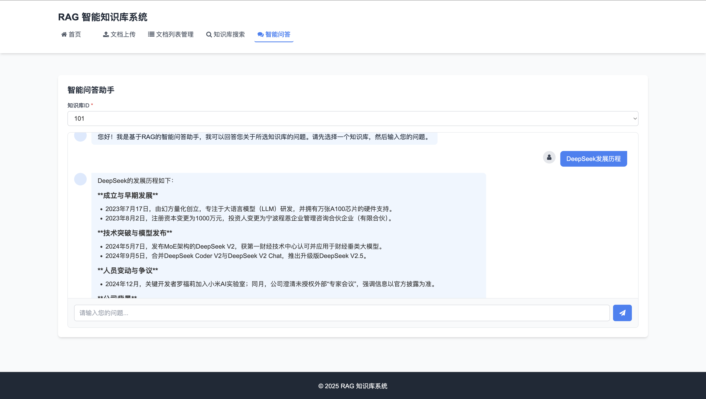

# RAG 知识库系统

基于检索增强生成（RAG）技术的知识库系统，支持文档上传、智能分块、向量检索、智能问答等功能。

## 页面效果



## 项目结构

```
rag_es_project/
├── app.py                 # Flask应用入口
├── config/
│   └── backend.yaml       # 配置文件
├── controllers/
│   ├── __init__.py
│   ├── document_controller.py  # 分块控制器
│   ├── document_controller.py  # 文档控制器
│   └── search_controller.py    # 搜索控制器
├── core/
│   ├── __init__.py
│   ├── database.py        # 数据库连接和ORM
│   ├── elasticsearch_client.py  # ES客户端封装
│   ├── llm_client.py       # LLM客户端封装
│   └── minio_client.py    # MinIO客户端封装
├── models/
│   ├── __init__.py
│   ├── chunk.py            # 分块模型
│   ├── document.py         # 文档模型
│   └── dto.py
├── services/
│   ├── __init__.py
│   ├── chunk_service.py        # 分块服务
│   ├── document_service.py     # 文档服务
│   └── search_service.py       # 搜索服务
├── utils/
│   ├── __init__.py
│   ├── config.py               # 配置文件读取工具
│   ├── text_splitter.py        # 文本分割工具
│   └── embedding_utils.py      # 向量化工具
├── static/                     #前端静态资源
│   ├── css/
│   │   └── style.css
│   ├── js/
│   │   └── main.js
│   └── images/
├── templates/                  #前端页面
│   ├── index.html
│   ├── upload.html
│   ├── chunk_list.html
│   ├── document_list.html
│   └── search.html
├── requirements.txt            #项目包依赖管理
└── README.md
```


## 功能特点

1. **文档管理**：支持TXT、PDF、DOCX等格式文档上传、存储、删除
2. **智能分块**：自动将文档分割为语义连贯的文本块
3. **向量嵌入**：使用OpenAI embedding模型将文本转换为向量
4. **多模式检索**：支持全文检索、向量检索、混合检索
5. **知识库隔离**：不同知识库数据独立存储和检索
6. **智能问答**：基于检索结果进行问答


## 环境要求
- Python 3.8+
- MySQL 5.7+
- Elasticsearch 8.x
- MinIO (或兼容S3的对象存储)
- Node.js (可选，用于前端开发)


## 快速开始

### 后端部署

#### 1. 安装依赖
```bash
pip install -r requirements.txt
```

#### 2.配置修改
编辑 *config/backend.yaml*，修改数据库、ES、MinIO 等配置

#### 3.启动服务
```bash
python app.py
```

### 前端部署

直接通过浏览器访问后端服务的静态文件（Flask 默认托管）

### 接口说明
#### 文档管理
- POST /api/documents/upload：上传文档
- GET /api/documents/page：获取文档列表(分页)
- DELETE /api/documents/<document_id>：删除文档
- POST /api/documents/modify_status：修改文档状态【启用\禁用】
#### 分块管理
- GET /api/chunk/page：获取分块列表(分页)
- DELETE /api/chunk/<chunk_id>：删除分块
- POST /api/chunk/modify_status：修改分块状态【启用\禁用】
#### 搜索服务
- GET /api/search：搜索知识库
- GET /api/search/chat：智能问答，搜索知识库并回复

##### 文档上传说明：
- /api/documents/upload
    - 1、上传文档至MinIO
    - 2、解析文档，生成分块
    - 3、将文档、分块保存至数据库
    - 4、生成向量并保存至Elasticsearch
    - 5、返回接口响应


#### 技术栈
- **后端**：Flask、SQLAlchemy、Elasticsearch、MinIO SDK
- **前端**：HTML、CSS、JavaScript（可扩展为 Vue/React）
- **AI 相关**：LangChain、OpenAI Embedding
- **数据库**：MySQL（元数据）、Elasticsearch（检索）、MinIO（文档存储）


#### 基础中间件安装
- MinIO：docker 
- MySQL：brew（mac系統）
- Elasticsearch、Kibana：本地解压包使用命令行启动
    


